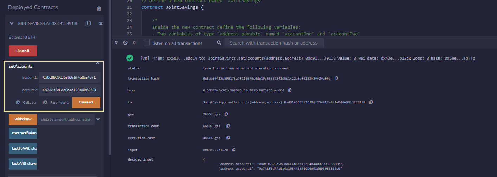
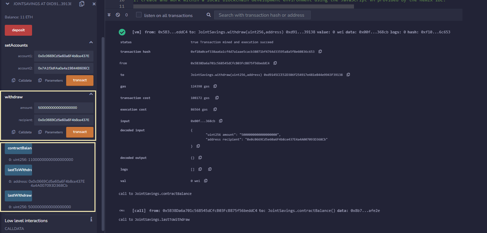
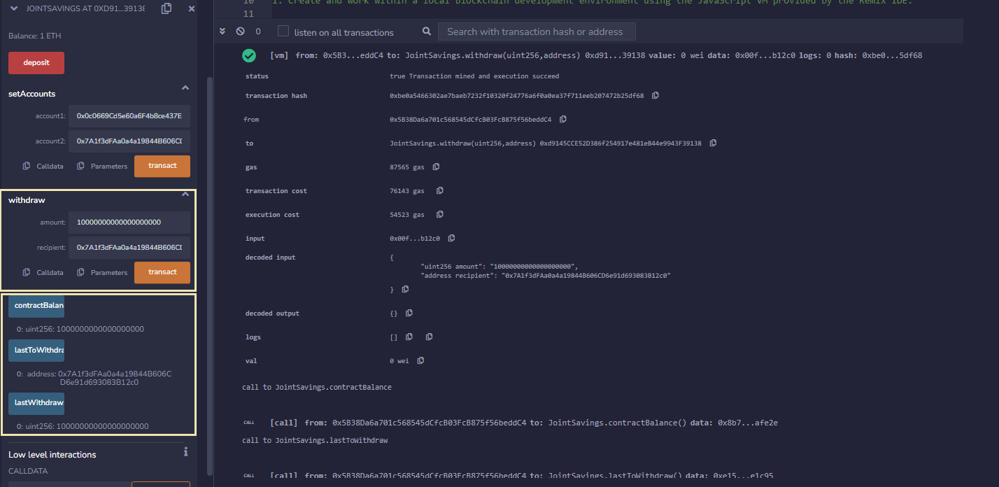

# Solidity Smart Contract

This project entails the creation of a Solidity smart contract that accepts two user addresses, which will be able to control a joint savings account. The smart contract uses ether management functions to deposit and withdraw funds from the account.

In this case, three different steps are followed: 

1. Creating a Joint Savings Account Contract in ```Solidity```.
2. Compiling and Deploying the Contract in the ```JavaScript VM```.
3. Interacting with the Deployed Smart Contract by depositing and withdrawing funds.

---

## Technologies

The whole project is implemented in ```Solidity```, writen in [Remix](https://remix.ethereum.org/) and deployed in the ```JavaScript VM```.

---

## Usage

1. In the Remix interface, the `joint_savings.sol` must be compiled and deployed. It contains the contract created in Solidity (`JointSavings`) with its required variables, and also several functions for de transfer process: `withdraw`, `deposit`, `setAccounts` and the fallback function that runs in two scenarios: if the function identifier doesn’t match any other function in the contract or if the sending function supplies no data.

2. Once deployed, two dummy account addresses are introduced, being the authorized Ethereum addresses that will be able to withdraw fund from the contract: 




3. Then the **Deposit** functionality of the smart contract is tested by sending three different transactions: 1) 1 ether as wei, 2) 10 ether as wei and 3) 5 ether. After each transaction,the contractBalance function is used to verify that the funds were added to the contract:


4. Finally, the **Withdrawal** functionality is tested by withdrawing 5 ether into `accountOne` and 10 ether into `accountTwo`. After each transaction, the contractBalance function is used to verify that the funds were withdrawn from the contract. Also, the lastToWithdraw and lastWithdrawAmount functions are checked to verify that the address and amount were correct:





---

## Contributors

Feature developed by Lourdes Dominguez [(LinkedIn profile)](https://www.linkedin.com/in/lourdes-dominguez-bengoa-12333044/)

---

## License

Use only for academic purposes.